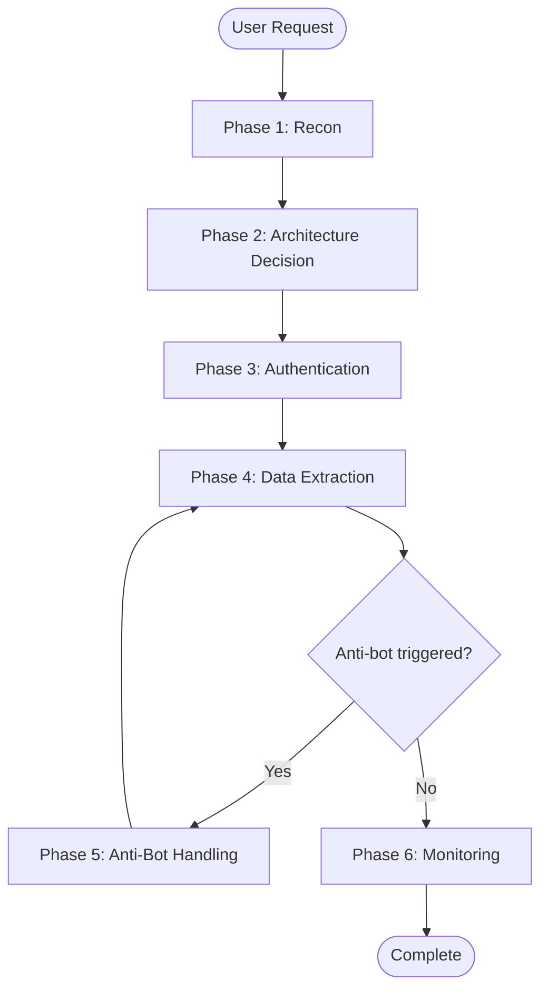
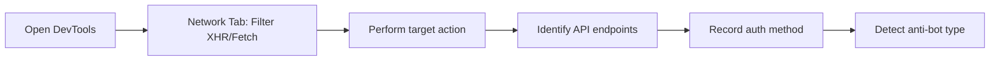
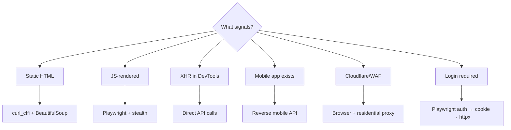
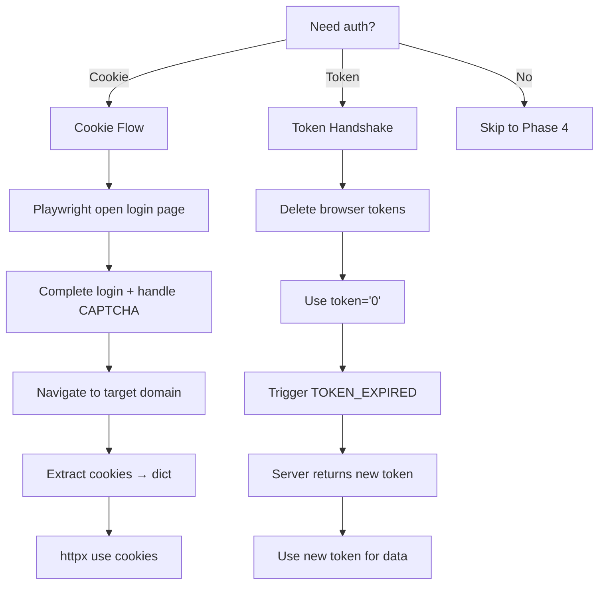
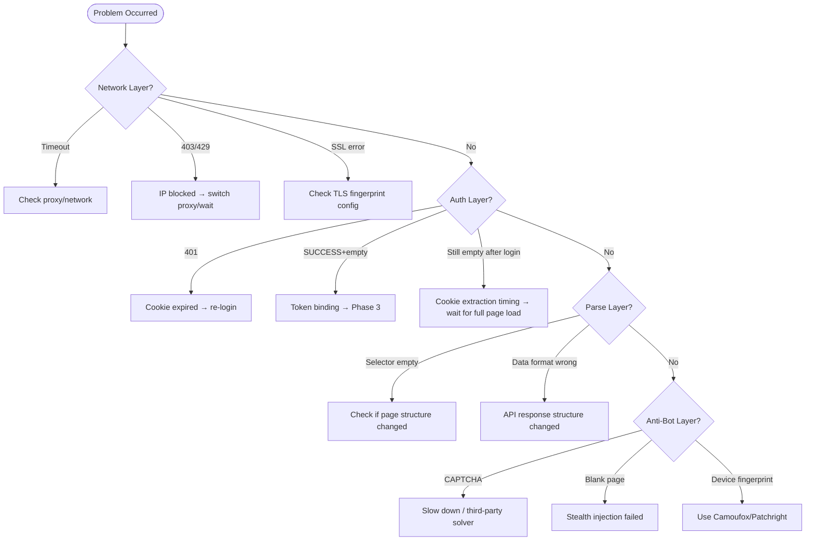

# Web Scraping Workflow

> AI task entry point. 6-phase execution framework + symptom-driven troubleshooting.

## Quick Start Flowchart



**Executable template**: `scripts/unified_scraper.py` + `scripts/config.yaml`

---

## Phase 1: Recon

**Goal**: Identify data source, authentication method, anti-bot mechanisms.



### Steps
1. **DevTools Network**: Open target page, filter by XHR/Fetch, perform target action (paginate, search)
2. **Identify API endpoint**: Find request returning data, record URL, Method, Headers, Body
3. **Auth method**: Cookie? Bearer Token? API Key? Query Param?
4. **Anti-bot signal**: Cloudflare? reCAPTCHA? Signature params?

### Output Checklist
- [ ] API endpoint URL
- [ ] Authentication method + required credentials
- [ ] Pagination mechanism (page/cursor/offset)
- [ ] Anti-bot type (none/Cloudflare/platform-specific)

**Reference**: [api-discovery.md](api-discovery.md) - Browser Recon → Direct HTTP full flow

---

## Phase 2: Architecture Decision



### Config Template
```yaml
# config.yaml
crawl_strategy:
  mode: "http"  # or "browser"
  concurrency: 5
  delay:
    min: 1.0
    max: 2.5
anti_detection:
  impersonate: "chrome110"  # curl_cffi TLS fingerprint
  proxy:
    enabled: false
    url: ""
```

**Reference**: [scraping-patterns.md](scraping-patterns.md#browser-open-architecture-recommended)

---

## Phase 3: Authentication



### Cookie Authentication Flow
```
1. Playwright open login page
2. Complete login (handle CAPTCHA manually/automatically)
3. Navigate to target domain (ensure complete cookies)
4. Extract cookies → convert to dict
5. httpx use extracted cookies
```

### Token Handshake (CRITICAL!)
When API uses token signatures (e.g., Taobao mtop):
```python
# Delete browser tokens, force refresh
api_cookies = {k: v for k, v in cookies.items() if "_m_h5_tk" not in k}
token = "0"  # Triggers TOKEN_EXPIRED
# Call 1: Server returns new token
# Call 2: Use new token to get data
```

**Symptom**: API returns SUCCESS but empty data → 99% token binding issue

**Reference**: [taobao-mtop.md](taobao-mtop.md#token-handshake-protocol)

---

## Phase 4: Data Extraction

### Execute unified_scraper.py
```bash
cd scripts
python unified_scraper.py
```

### Pagination Strategy
```python
consecutive_empty = 0
for page_num in range(2, max_pages + 1):
    data = await fetch_page(page_num)
    if data.has_results:
        process(data)
        consecutive_empty = 0
    else:
        consecutive_empty += 1
        if consecutive_empty >= 3:
            break  # 3 consecutive empty = reached end
```

### Incremental Save
```yaml
storage:
  type: "jsonl"
  filepath: "output/data.jsonl"
  save_interval: 50  # Save every 50 items
```

**Reference**: [infrastructure.md](infrastructure.md)

---

## Phase 5: Anti-Bot Handling

### Symptom → Cause → Solution Table

| Symptom | Likely Cause | Solution |
|---------|--------------|----------|
| 403/429 | IP blocked | 1. Wait 5-10min 2. Switch proxy 3. Reduce concurrency |
| RGV587 (Taobao) | Debug density triggered | Wait 10+ min, reduce test frequency |
| SUCCESS + empty data | Token binding failed | See Phase 3 Token Handshake |
| Cookie count < 60 | Session degraded | Re-navigate to main domain, refresh cookies |
| CAPTCHA | Behavioral anomaly | 1. Slow down 2. Simulate human delays 3. Third-party solver |
| Behavioral detection | No mouse/scroll/human patterns | Add [browser behavior simulation](anti-detection.md#browser-behavior-simulation) |
| Blank page | JS detected webdriver | Check stealth.js injection |

### 2026 Tool Selection

| Tool | Purpose | Install |
|------|---------|--------|
| curl_cffi | TLS/JA3 fingerprint | `pip install curl_cffi` |
| Camoufox | Firefox C++ level spoofing | `pip install camoufox` |
| Patchright | Playwright CDP patches | `pip install patchright` |

**Reference**: [anti-detection.md](anti-detection.md)

---

## Phase 6: Monitoring

### Health Metrics

| Metric | Healthy | Action on Anomaly |
|--------|---------|-------------------|
| Success rate | >90% | <80% pause, check anti-bot |
| Cookie count | 69-130 | <60 re-login |
| Response time | <5s | >10s reduce concurrency |
| Empty page rate | <10% | >20% check pagination logic |

### Progress Output
```python
logger.info(f"Progress: {completed}/{total} | Success: {success_rate:.1f}% | ETA: {eta_min:.1f}min")
```

---

## Troubleshooting Decision Tree



---

## File Reference Map

| Scenario | Reference File | Section |
|----------|---------------|--------|
| SPA reverse | api-discovery.md | Phase 1-3 |
| Taobao/Tmall | taobao-mtop.md | Token Handshake |
| ABC architecture | production-architecture.md | MediaCrawler Pattern |
| Stealth config | anti-detection.md | Browser Launch |
| Browser behavior | anti-detection.md | Browser Behavior Simulation |
| Proxy selection | anti-detection.md | Sticky vs Rotating |
| Cookie handling | scraping-patterns.md | Cookie Domain Priority |
| Large-scale | infrastructure.md | Streaming/Chunked |
| Data cleaning/export | data-pipeline.md | Multi-Format Export |
| 小红书 (XiaoHongShu) | xiaohongshu.md | Signature Headers |
| 抖音 (Douyin) | douyin.md | Signature System |
| 快手 (Kuaishou) | kuaishou.md | GraphQL API Pattern |
| B站 (Bilibili) | bilibili.md | WBI Signature System |
| 微博 (Weibo) | weibo.md | Container-Based API |
| 贴吧 (Tieba) | tieba.md | Full Browser Scraping |
