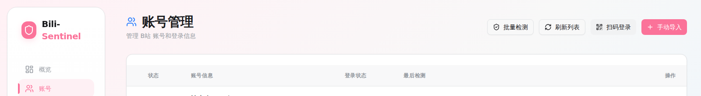
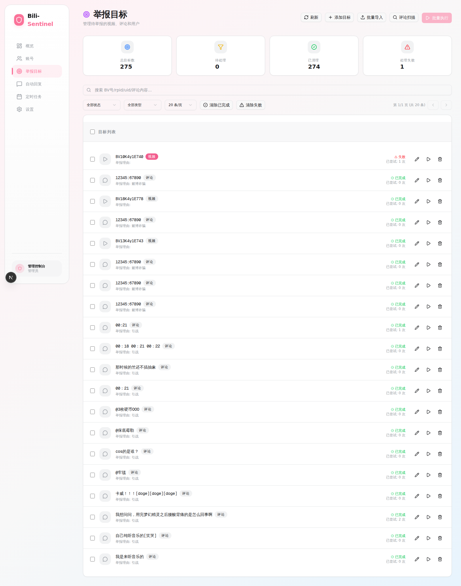

# Bili-Sentinel

> 一个开箱即用的 B站自动化工具：多账号管理、批量举报、自动回复、定时任务，一键部署就能用。

Bili-Sentinel 是一个面向 Bilibili 运营与风控场景的自动化控制台：  
集中管理多账号、批量处理举报目标、定时执行任务、自动回复私信，并提供可视化状态与日志追踪。

## 页面预览

### 仪表盘


### 账号管理



### 目标管理



## 技术栈

- Backend: FastAPI (Python 3.12+) + SQLite
- Frontend: Next.js 16 + React 19 + TypeScript
- Runtime: Docker / Docker Compose（单容器模式）
- Frontend Package Manager: Bun（默认）

## 真实使用场景

- 批量举报任务：针对视频/评论/用户目标做集中化处理
- 账号运营维护：统一维护 Cookie、账号状态与健康检查
- 自动化值守：配置定时任务与自动回复，降低重复人工操作
- 过程可观测：通过仪表盘与日志追踪执行结果

## 目录说明

- `backend/` 后端 API、业务逻辑、数据库访问
- `frontend/` 前端页面与 API 代理
- `scripts/` 辅助脚本
- `data/` 运行期数据目录（SQLite、导出文件等）

---

## 一键部署（Docker，推荐）

### 0. 前置条件

- 已安装 Docker + Docker Compose 插件
- 可访问镜像仓库（首次构建需要拉取基础镜像）

### 1. 克隆项目并进入目录

```bash
git clone <your-repo-url>
cd bilibili
```

### 2. 复制配置模板

```bash
cp .env.example .env
```

### 3. 按需修改 `.env`

默认开箱可跑；如果你是 WSL 或特殊网络环境，按需改 `BACKEND_INTERNAL_URL`。

### 4. 构建并后台启动

```bash
docker compose up --build -d
```

### 5. 验证是否启动成功

建议至少检查一次后端健康状态与前端代理链路：

```bash
docker compose ps
curl -fsS http://localhost:8000/health
curl -fsS http://localhost:3000/api/system/info
```

### 6. 打开系统

- 前端：`http://localhost:3000`
- 后端健康检查：`http://localhost:8000/health`

如果你配置了 `SENTINEL_API_KEY`，记得带请求头验证：

```bash
curl -fsS -H "X-API-Key: ${SENTINEL_API_KEY}" http://localhost:3000/api/system/info
```

---

## 配置项说明（`.env`）

| 变量 | 默认值 | 说明 |
|---|---|---|
| `SENTINEL_API_KEY` | 空 | 后端 API 鉴权密钥；留空表示不启用鉴权 |
| `SENTINEL_DEBUG` | `false` | 后端调试开关 |
| `SENTINEL_HOST` | `0.0.0.0` | 后端监听地址 |
| `SENTINEL_PORT` | `8000` | 后端端口 |
| `FRONTEND_PORT` | `3000` | 前端端口（容器内 `next start` 端口） |
| `BACKEND_INTERNAL_URL` | `http://localhost:8000` | 前端 API 代理转发到后端的地址 |

### 多环境示例

通用环境（推荐默认）：

```bash
BACKEND_INTERNAL_URL=http://localhost:8000
```

WSL/特殊网络环境：

```bash
BACKEND_INTERNAL_URL=http://127.0.0.1:8000
```

---

## 使用流程（Web 页面）

启动后按这个顺序操作最省事：

1. **账号管理（`/accounts`）**
   - 添加账号（SESSDATA / bili_jct / buvid3）或使用扫码登录
   - 确认账号状态为可用
2. **目标管理（`/targets`）**
   - 添加待处理目标（视频/评论/用户）
   - 检查目标状态与数量
3. **任务执行（首页或 `/scheduler`）**
   - 手动执行批量任务，或配置定时任务
4. **自动回复（`/autoreply`）**
   - 配置规则与轮询任务
5. **系统配置（`/config`）**
   - 调整系统参数，查看运行状态

---

## 常用运维命令

启动：

```bash
docker compose up -d
```

查看日志：

```bash
docker compose logs -f
```

重启：

```bash
docker compose restart
```

停止：

```bash
docker compose down
```

更新代码后重新部署：

```bash
git pull
docker compose up --build -d
```

备份数据目录（建议定期）：

```bash
tar -czf backup-data-$(date +%F).tar.gz data/
```

---

## 本地开发（非 Docker）

### 0. 创建虚拟环境（推荐）

```bash
python3 -m venv .venv
source .venv/bin/activate
python -m pip install --upgrade pip
```

### 后端

```bash
pip install -r backend/requirements.txt
uvicorn backend.main:app --host 0.0.0.0 --port 8000 --workers 1
```

### 前端

```bash
cd frontend
bun install
bun run dev
```

如果你本机没有 Bun，也可以临时使用 `npm install && npm run dev`。

### 启动后检查（建议单开第三个终端）

```bash
curl -fsS http://127.0.0.1:8000/health
curl -fsS http://127.0.0.1:3000/api/system/info
```

如果启用了 `SENTINEL_API_KEY`，改为：

```bash
curl -fsS -H "X-API-Key: ${SENTINEL_API_KEY}" http://127.0.0.1:8000/api/system/info
curl -fsS -H "X-API-Key: ${SENTINEL_API_KEY}" http://127.0.0.1:3000/api/system/info
```

本地默认访问：

- 前端：`http://localhost:3000`
- 后端：`http://localhost:8000`

---

## 故障排查

1. **前端 3000 无法访问**
   - 执行 `docker compose ps`，确认容器状态是否为 `Up`
2. **接口报 502（Backend unavailable）**
   - 检查 `.env` 里的 `BACKEND_INTERNAL_URL` 是否可达
3. **接口报 401/403**
   - 检查 `SENTINEL_API_KEY` 与请求头 `X-API-Key` 是否一致
4. **端口冲突**
   - 修改宿主机端口映射或释放本地 3000/8000 端口

---

## 安全与合规提示

- 禁止使用本项目进行任何会影响官方平台稳定性、服务质量或正常运营的行为（如滥用请求、恶意批量操作、绕过风控）。
- 禁止将本项目用于未授权的商业化批量操作、灰黑产或其他违规用途。
- 使用前请确保已获得合法授权，并严格遵守目标平台服务条款与所在地法律法规。
- 因使用本项目导致的账号封禁、数据损失、纠纷或法律风险，均由使用者自行承担。

## 免责声明

本项目仅用于学习、研究与技术交流。  
请遵守目标平台条款与适用法律法规。  
任何基于本项目进行的实际使用、二次开发或部署行为及其后果，均由使用者自行承担，与项目维护者无关。

## License

本项目采用 [MIT License](./LICENSE)。
