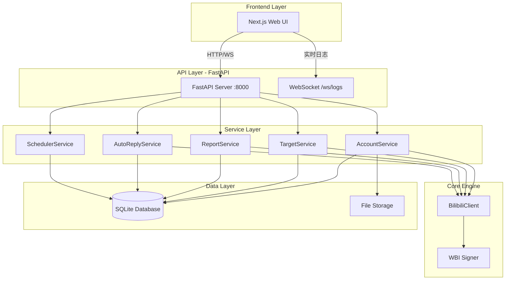

# 后端架构设计：Bili-Sentinel

## 1. 整体架构



---

## 2. 目录结构

```
/home/jikns/Projects/bilibili/
├── backend/
│   ├── main.py                 # FastAPI 入口
│   ├── config.py               # 配置管理
│   ├── database.py             # SQLite 初始化
│   │
│   ├── api/                    # API 路由层
│   │   ├── __init__.py
│   │   ├── accounts.py         # /api/accounts
│   │   ├── targets.py          # /api/targets
│   │   ├── reports.py          # /api/reports
│   │   ├── autoreply.py        # /api/autoreply
│   │   ├── scheduler.py        # /api/scheduler
│   │   └── websocket.py        # /ws/logs
│   │
│   ├── services/               # 业务逻辑层
│   │   ├── __init__.py
│   │   ├── account_service.py
│   │   ├── target_service.py
│   │   ├── report_service.py
│   │   ├── autoreply_service.py
│   │   ├── autoreply_polling.py
│   │   └── scheduler_service.py
│   │
│   ├── core/                   # 核心引擎（现有代码迁移）
│   │   ├── bilibili_client.py
│   │   ├── bilibili_auth.py
│   │   ├── wbi_sign.py
│   │   └── reporting_manager.py
│   │
│   ├── models/                 # Pydantic 模型
│   │   ├── __init__.py
│   │   ├── account.py
│   │   ├── target.py
│   │   ├── report.py
│   │   └── task.py
│   │
│   └── db/                     # 数据库相关
│       ├── schema.sql
│       └── migrations/
│
├── frontend/                   # Next.js（已初始化）
│
└── data/
    ├── sentinel.db             # SQLite 数据库
    └── exports/                # 导出文件目录
```

---

## 3. 数据库设计 (SQLite)

### 3.1 accounts 表
```sql
CREATE TABLE accounts (
    id INTEGER PRIMARY KEY AUTOINCREMENT,
    name TEXT NOT NULL,
    uid INTEGER,
    sessdata TEXT NOT NULL,
    bili_jct TEXT NOT NULL,
    buvid3 TEXT,
    group_tag TEXT DEFAULT 'default',
    is_active BOOLEAN DEFAULT 1,
    last_check_at DATETIME,
    status TEXT DEFAULT 'unknown',  -- valid/invalid/unknown
    created_at DATETIME DEFAULT CURRENT_TIMESTAMP
);
```

### 3.2 targets 表
```sql
CREATE TABLE targets (
    id INTEGER PRIMARY KEY AUTOINCREMENT,
    type TEXT NOT NULL,             -- video/comment/user
    identifier TEXT NOT NULL,       -- BV号/rpid/uid
    aid INTEGER,                    -- 视频的aid（可选）
    reason_id INTEGER,
    reason_text TEXT,
    status TEXT DEFAULT 'pending',  -- pending/processing/completed/failed
    retry_count INTEGER DEFAULT 0,
    created_at DATETIME DEFAULT CURRENT_TIMESTAMP,
    updated_at DATETIME
);
```

### 3.3 report_logs 表
```sql
CREATE TABLE report_logs (
    id INTEGER PRIMARY KEY AUTOINCREMENT,
    target_id INTEGER REFERENCES targets(id),
    account_id INTEGER REFERENCES accounts(id),
    action TEXT NOT NULL,           -- report_video/report_comment/report_user
    request_data TEXT,              -- JSON
    response_data TEXT,             -- JSON (完整API响应)
    success BOOLEAN,
    error_message TEXT,
    executed_at DATETIME DEFAULT CURRENT_TIMESTAMP
);
```

### 3.4 autoreply_config 表
```sql
CREATE TABLE autoreply_config (
    id INTEGER PRIMARY KEY AUTOINCREMENT,
    keyword TEXT,                   -- NULL 表示默认回复
    response TEXT NOT NULL,
    priority INTEGER DEFAULT 0,
    is_active BOOLEAN DEFAULT 1
);
```

### 3.5 scheduled_tasks 表
```sql
CREATE TABLE scheduled_tasks (
    id INTEGER PRIMARY KEY AUTOINCREMENT,
    name TEXT NOT NULL,
    task_type TEXT NOT NULL,        -- report_batch/autoreply_poll
    cron_expression TEXT,           -- 如 "*/30 * * * *"
    interval_seconds INTEGER,       -- 简单间隔模式
    is_active BOOLEAN DEFAULT 1,
    last_run_at DATETIME,
    next_run_at DATETIME,
    config_json TEXT                -- 任务配置
);
```

---

## 4. API 路由设计

### 4.1 账号管理 `/api/accounts`
| 方法 | 路径 | 描述 |
|------|------|------|
| GET | `/` | 获取所有账号列表 |
| POST | `/` | 添加新账号 |
| PUT | `/{id}` | 更新账号信息 |
| DELETE | `/{id}` | 删除账号 |
| POST | `/{id}/check` | 检查账号有效性 |
| POST | `/import` | 批量导入账号 (JSON) |
| GET | `/export` | 导出所有账号 |

### 4.2 目标管理 `/api/targets`
| 方法 | 路径 | 描述 |
|------|------|------|
| GET | `/` | 获取目标列表（支持分页/筛选） |
| POST | `/` | 添加单个目标 |
| POST | `/batch` | 批量添加目标 (CSV/JSON) |
| PUT | `/{id}` | 更新目标状态 |
| DELETE | `/{id}` | 删除目标 |
| GET | `/export` | 导出目标列表 |

### 4.3 举报执行 `/api/reports`
| 方法 | 路径 | 描述 |
|------|------|------|
| POST | `/execute` | 执行举报任务（单个目标，多账号） |
| POST | `/execute/batch` | 批量执行所有 pending 目标 |
| GET | `/logs` | 获取举报日志 |
| GET | `/logs/{target_id}` | 获取特定目标的详细日志 |

### 4.4 自动回复 `/api/autoreply`
| 方法 | 路径 | 描述 |
|------|------|------|
| GET | `/config` | 获取回复配置 |
| POST | `/config` | 添加关键词回复 |
| PUT | `/config/{id}` | 更新回复配置 |
| DELETE | `/config/{id}` | 删除回复配置 |
| POST | `/enable` | 启用自动回复轮询开关（仅自动回复，不影响 scheduler 任务） |
| POST | `/disable` | 停用自动回复轮询开关（仅自动回复，不影响 scheduler 任务） |
| GET | `/status` | 获取服务状态 |

自动回复规则匹配顺序：
- 仅加载 `is_active = 1` 的规则
- 按 `priority DESC, id ASC` 排序，`priority` 相同按创建顺序（`id` 升序）匹配
- 按顺序命中第一条关键词规则即返回；未命中时使用默认回复（`keyword = NULL`），若未配置则回退系统文案

### 4.5 定时任务 `/api/scheduler`
| 方法 | 路径 | 描述 |
|------|------|------|
| GET | `/tasks` | 获取所有定时任务 |
| POST | `/tasks` | 创建定时任务 |
| PUT | `/tasks/{id}` | 更新任务配置 |
| DELETE | `/tasks/{id}` | 删除任务 |
| POST | `/tasks/{id}/toggle` | 启用/禁用任务 |
| GET | `/history` | 获取执行历史 |

### 4.6 WebSocket `/ws/logs`
- 实时推送执行日志
- 支持按类型过滤（report/autoreply/scheduler）

---

## 5. 服务层设计

### 5.1 AccountService
```python
class AccountService:
    async def get_all() -> List[Account]
    async def add(account: AccountCreate) -> Account
    async def check_validity(account_id: int) -> bool
    async def get_active_accounts() -> List[Account]
    async def refresh_wbi_keys(account_id: int)
```

### 5.2 ReportService
```python
class ReportService:
    async def execute_report(target_id: int, account_ids: List[int]) -> List[ReportLog]
    async def execute_batch(target_ids: List[int]) -> BatchResult
    async def get_logs(target_id: int) -> List[ReportLog]
```

### 5.3 SchedulerService
```python
class SchedulerService:
    def __init__(self, apscheduler: AsyncIOScheduler)
    async def create_task(task: TaskCreate) -> ScheduledTask
    async def toggle_task(task_id: int) -> bool
    async def execute_now(task_id: int)
```

### 5.4 AutoReply 与 Scheduler 职责边界

| 模块 | 职责 | 非职责 |
|------|------|--------|
| `autoreply_service.py` | 自动回复规则 CRUD、独立开关（start/stop/status） | 不负责 APScheduler 任务注册/触发 |
| `autoreply_polling.py` | 单次轮询执行（拉取会话、规则匹配、发送回复、状态去重、日志落库） | 不负责定时策略与任务生命周期 |
| `scheduler_service.py` | 任务编排（Cron/Interval 注册、触发时机、任务状态更新） | 不实现自动回复业务细节 |

当前调用关系：
- 独立模式：`autoreply_service.start_service()` 周期性调用 `autoreply_polling.run_autoreply_poll_cycle()`
- 定时任务模式：`scheduler_service._run_autoreply_poll()` 仅负责调度，并调用同一个 `run_autoreply_poll_cycle()`

这样保证自动回复业务逻辑只有一份实现，避免 `autoreply_service` 与 `scheduler_service` 之间边界漂移。

---

## 6. 技术选型

| 组件 | 选型 | 理由 |
|------|------|------|
| Web 框架 | FastAPI | 原生异步、自动文档、类型提示 |
| 异步 HTTP | httpx | 现有代码已使用 |
| 调度器 | APScheduler | 支持 Cron、持久化 |
| 数据库 | SQLite | 轻量、无需外部服务 |
| ORM | 不使用 | 直接 aiosqlite，保持简单 |
| WebSocket | FastAPI 原生 | 日志实时推送 |
